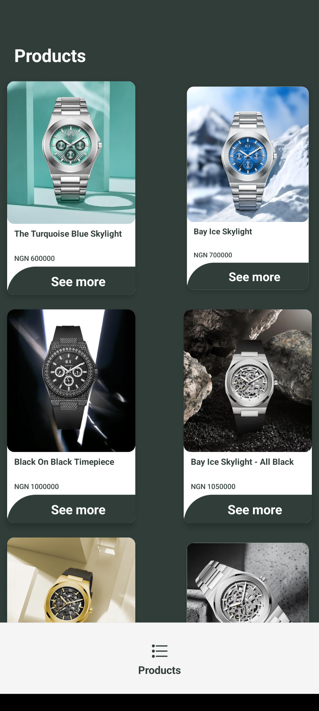
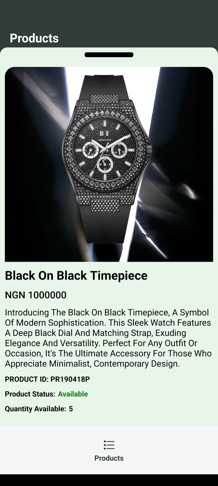

# TimbuApp

TimbuApp is a React Native mobile application designed to fetch and display a list of products from the Timbu API. The app allows users to view product details in a reanimated bottom sheet and refresh the product list.

## Features

- Fetch and display a list of products from the Timbu API.
- View product details in a reanimated bottom sheet.
- Refresh the product list.
- Error handling and loading states.
- Clean and responsive UI design.

## Screens

### Product Listing Screen

Displays a list of products with a refresh option. Each product card can be clicked to view details in a bottom sheet.

### Product Details Screen a component

Shows detailed information about the selected product, including an image, name, price, description, availability status, and quantity.

## Installation

1. Clone the repository:

   ```sh
   git clone https://github.com/oceeboy/timbuapp
   cd timbuapp
   ```

2. Install dependencies:

   ```sh
   npm install
   ```

3. Start the development server:

   ```sh
   npm start
   ```

4. Run the app on an Android or iOS simulator:
   ```sh
   npm run android
   npm run ios
   ```

## Dependencies

- React Native
- Expo
- Axios
- @react-navigation/native
- @react-navigation/bottom-tabs
- @react-navigation/native-stack
- @gorhom/bottom-sheet
- react-native-gesture-handler
- react-native-reanimated
- react-native-safe-area-context
- react-native-screens

## Usage

### Fetching Products

The `getProducts` function in `apiService.js` makes an API call to fetch the list of products from Timbu API.

### Product Listing Screen

The `ProductListingScreen` component fetches the products and displays them in a grid. It uses a bottom sheet modal to show product details when a product card is clicked.

### Product Details

The `ProductDetails` component displays detailed information about a selected product. It retrieves the selected product from the context.

## APK download Link

[Click here to download the apk ](https://expo.dev/artifacts/eas/n1pKgb8hoMEmkQSfpJuoZV.apk)

## Screenshots

### Product Listing Screen



### Product Details Screen



## Appetize Showcase (Demo Link)

[Click here View](https://appetize.io/app/b_hthgtgdtunm77zcej6xzuka46e)

## Acknowledgements

- [**React Native Documentation**](https://reactnative.dev/)
- [**Expo Documentation**](https://docs.expo.dev/)
- [**Timbu API**](https://docs.timbu.cloud/)
- [**HNG Internship**](https://hng.tech/)

## Contact

For any inquiries, please contact [osieta33@gmail.com](mailto:osieta33@gmail.com).
